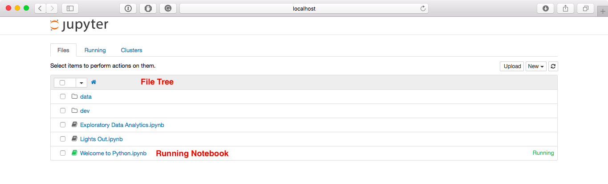
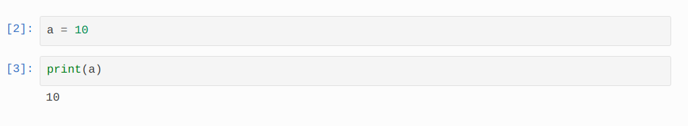
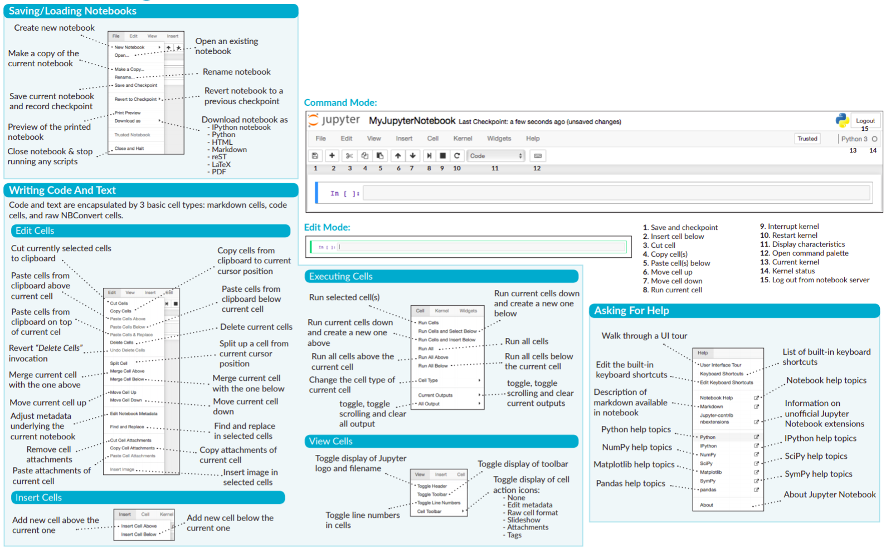

## Using Jupyter notebooks
_Official documentation : https://jupyter-notebook.readthedocs.io/en/stable/_  
### Opening the Notebook
Enter following in terminal (Linux/MacOS) or command prompt (Windows)  
```bash  
jupyter notebook  
```  
or you can directly launch in Anaconda Navigator (Windows)  

The Jupyter Notebook aims to support the latest versions of these browsers:  
* Chrome  
* Safari  
* Firefox  

Up to date versions of Opera and Edge may also work, but if they don’t, please use one of the supported browsers.  
Using Safari with HTTPS and an untrusted certificate is known to not work (websockets will fail).  

### Jupyter Notebook Dashboard
  
_To see all of your running notebooks along with their directories, click on the “Running” tab:_  

### Creating a new notebook document
  
_GIF Credits : https://jupyter-notebook.readthedocs.io/en/stable/_  

### Overview of the Notebook UI
The notebook UI has the following main areas:  
* Menu  
* Toolbar  
* Notebook area and cells  

#### Notebook user interface  
  

### Cell types
Notebooks consist of a linear sequence of cells. There are three basic cell types:  
* Code cells: Input and output of live code that is run in the kernel  
* Markdown cells: Narrative text with embedded LaTeX equations  
* Raw cells: Unformatted text that is included, without modification, when notebooks are converted to different formats using nbconvert  

### Modal Editor
Starting with IPython 2.0, the Jupyter Notebook has a modal user interface.  
This means that the keyboard does different things depending on which mode the Notebook is in. There are two modes: edit mode and command mode.  

#### Edit Mode
Edit mode is indicated by a green cell border and a prompt showing in the editor area:  
  
Jupyter cell with green border  
When a cell is in edit mode, you can type into the cell, like a normal text editor.  
Enter edit mode by pressing Enter or using the mouse to click on a cell’s editor area.  

#### Command Mode
Command mode is indicated by a grey cell border with a blue left margin:  
  
Jupyter cell with blue & grey border  
When you are in command mode, you are able to edit the notebook as a whole, but not type into individual cells.   Most importantly, in command mode, the keyboard is mapped to a set of shortcuts that let you perform notebook and cell actions efficiently.  
Don’t try to type into a cell in command mode; unexpected things will happen!  
Enter command mode by pressing Esc or using the mouse to click outside a cell’s editor area.  

#### Running Code
The notebook is associated with the IPython kernel, therefore runs Python code.  
  
Code cells allow you to enter and run code

    Run a code cell using Shift-Enter  

There are two other keyboard shortcuts for running code:  

    Alt-Enter runs the current cell and inserts a new one below.  
    Ctrl-Enter runs the current cell and enters command mode.  

#### Keyboard Navigation
In edit mode, most of the keyboard is dedicated to typing into the cell’s editor.  
We recommend learning the command mode shortcuts in the following rough order:  
* Basic navigation: enter, shift-enter, up/k, down/j  
* Saving the notebook: s  
* Change Cell types: y, m, 1-6, t  
* Cell creation: a, b  
* Cell editing: x, c, v, d, z  
* Kernel operations: i, 0 (press twice)  

_For the full list of available shortcuts, click Help, Keyboard Shortcuts in the notebook menus._  

#### Mouse Navigation
The most important keyboard shortcuts are Enter, which enters edit mode, and Esc, which enters command mode.  
  

_For a quick tour of Notebook UI,  click Help, User Interface Tour in the notebook menus._  

#### Cheat Sheet for Menu Bar and Tool Bar


_Image Credits : www.Datacamp.com_  
_Cheat Sheet : https://s3.amazonaws.com/assets.datacamp.com/blog_assets/Jupyter_Notebook_Cheat_Sheet.pdf_  
